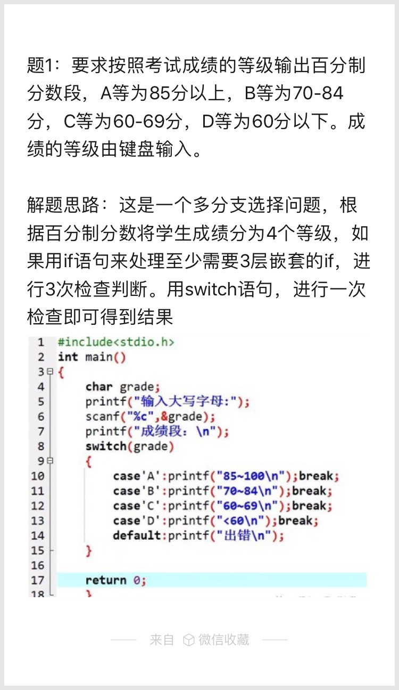
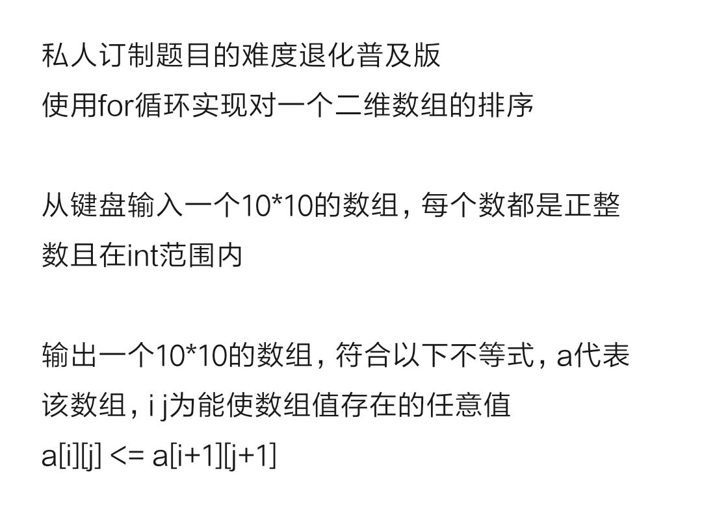

# Mission 1
要求按照考试成绩的等级输出百分制分数段，A等为85分以上，B等为70-84分，C等为60-69分，D等为60分以下。成绩的等级由键盘输入。



# Mission 2

**提高题**
使用for循环实现对一个二维数组的排序  
从键盘输入一个10*10的数组，每个数都是正整数且在int范围内  
输出一个10*10的数组，符合以下不等式，a代表该数组，i j为能使数组值存在的任意值  
```c
a[i][j] <= a[i+1][j+1]
```

# Mission EX
