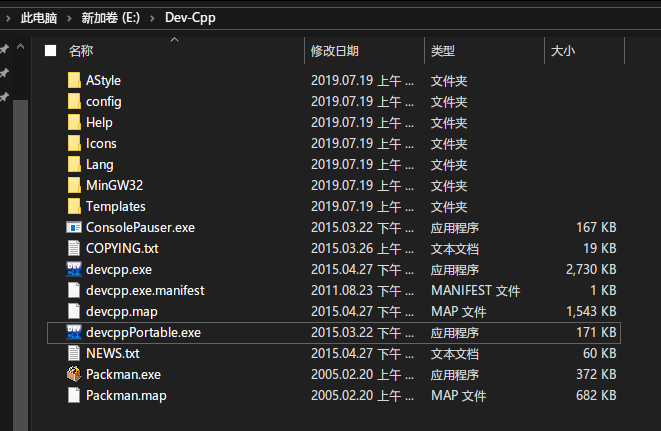
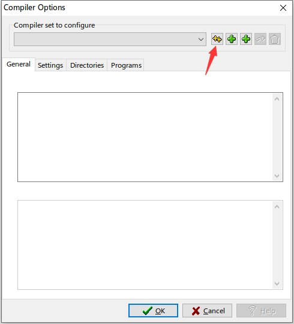
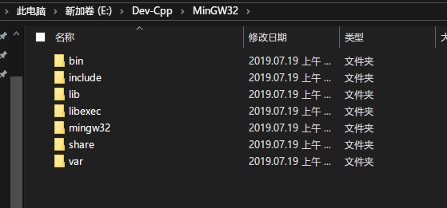

# 使用不带compiler的DevC++解决编译器和调试器问题

Dev-C++使用gcc/g++和gdb作为编译调试工具，但由于种种原因，很多版本的Dev-C++自带的编译调试工具都有或多或少的问题，编译器也无法及时更新，解决这个问题的其中一个办法就是安装不带编译调试工具的Dev-C++后自行配置。  
Windows下常见的管理这一套工具的软件叫做MinGW（Minimalist GNU for Windows），它包含了很多常用的工具和库（事实上也是Dev-C++在使用的那套工具）。  

## 下载

这里建议在[SourceForge](https://sourceforge.net/projects/orwelldevcpp/files/)上下载Dev-C++，防止下载到损坏的或过时的版本。每个版本都提供了Portable（免安装）和No Compiler（无编译器）的选择，本文使用的就是No Compiler版本。  
MinGW安装下载过程复杂缓慢，不适合向新手讲解，请直接向作者索要配置好的压缩文件。  

## 安装设置

Dev-C++的安装请参见[README](./README.md)的安装部分，下面是额外的设置部分  
首先找到Dev-C++的安装位置（右键快捷方式-属性-打开文件位置），将MinGW安装或解压至此处  
截图为已有MinGW的Portable版本。  
**注意，如果此处已经存在MinGW文件夹，则你安装的不是No Compiler版本**  
打开Dev-C++，点击Tools-Compiler Options（工具-编译选项），此时界面上应该是完全空白的，点击`自动查找并配置`按钮即可。  
  
**注意如果MinGW没有放置于正确的位置，Dev-C++无法正确完成自动配置**
  

The End