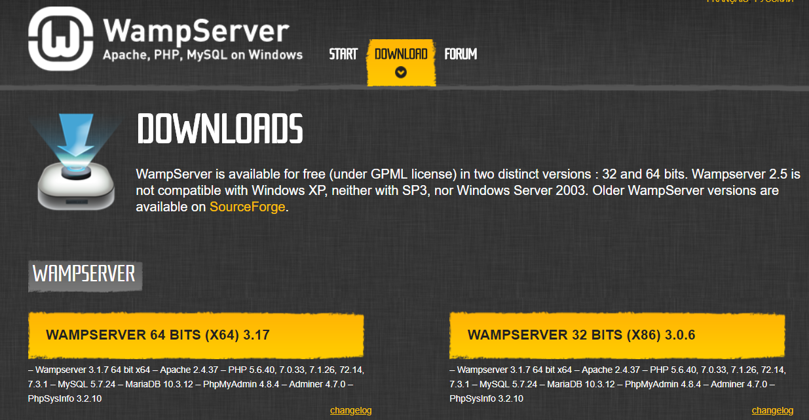
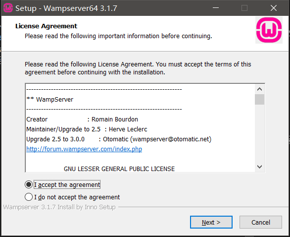
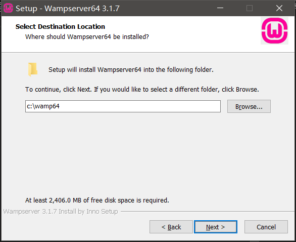
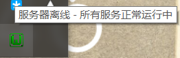
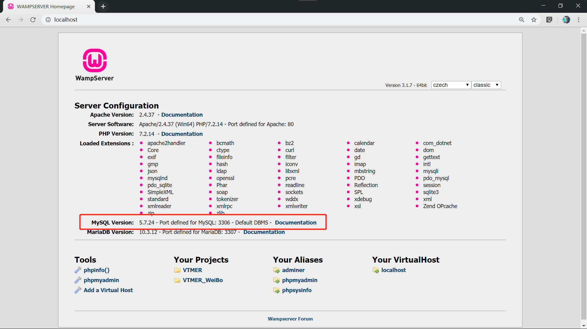
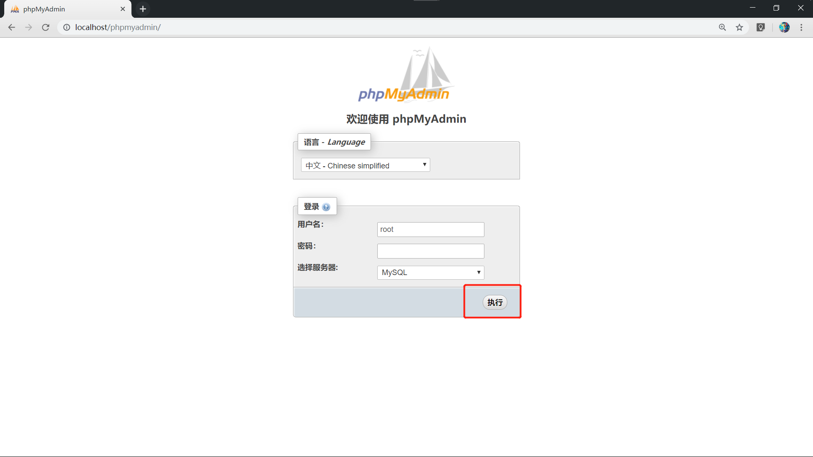
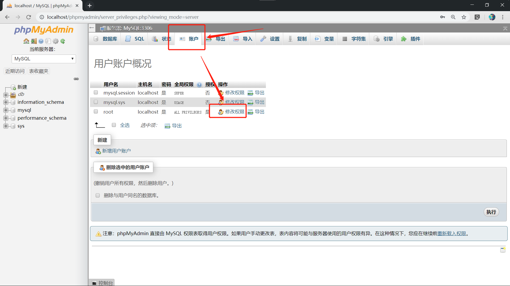
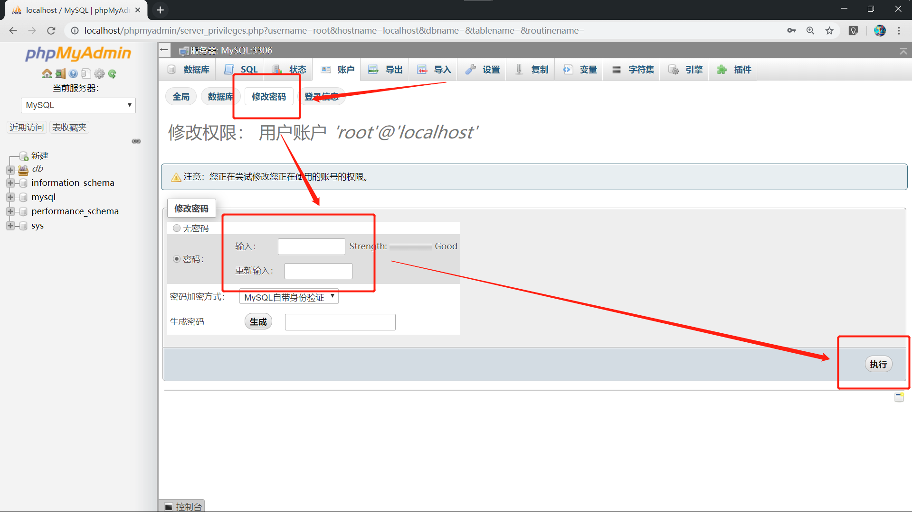

# 环境搭建/下载wamp与安装
- **作者Cerbur**
## 下载WAMP
### 官网下载

1. [wampserver官方网站](http://www.wampserver.com/en/#download-wrapper)  

       

1. 根据自己版本下载对应的版本64位系统下载64位版本，32位系统下载32位版本  
### 百度网盘下载  

1. [百度云](www.baidu.com)  
提取码：
~~这里我还没上传~~
## 安装wampserver  

1. 打开下载好的 wamp 安装包  

      

1. 一路点 next (这里可以选择修改路径，记得路径会影响之后的配置)  
    
      

1. 完成安装
## 启动wampserver

1. 点击启动 wampserver

      
期间会弹出一些命令行弹窗  

1. 若 wamp 所有服务正常运行将在状态栏看到一个绿色图标    

       

- 鼠标停留在上会显示所有服务正常运行  
- 若为红色则没有一个服务正常运行  
- 为橙色则为部分服务未正常运行  
- **未正常运行时慢慢排查问题所在**    

1. 打开浏览器输入[localhost](http://localhost/)  ，将看到以下界面则说明 apache 服务器运行成功，并可在界面中查看 MySQL 版本。  

       
## 修改 MySQL 服务密码   

1. 点击 Your Aliases 下的[phpMyAdmin](http://localhost/phpmyadmin/)  

       

1. 默认密码为空点击执行  

       

1. 进入界面后点击顶端导览的账户后点击修改权限  

       

1. 点击修改密码，输入自己能记住的密码。最好是 **4 位纯数字**密码，太长以后打开你会嫌烦的  

       
- 以上修改密码步骤后可用终端完成
- 若一开始上终端无休止打错东西
- 可能会劝退很多人
- 今后每次使用MySQL时候要运行wamp服务