# C/C++ 环境搭建  
- 作者: ELC.BELL.WebGroup.Cerbur
## 下载 Dev C++
[百度云: Dev C++](https://pan.baidu.com/s/1jSnEOVwOF9vzChWxtQYNKw)  
提取码: ``` e3fi ```

## 安装 Dev C++
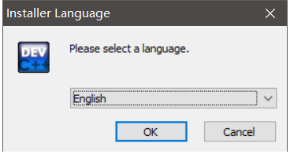    
选择 English 点``` OK ```在完成安装后可选择中文  

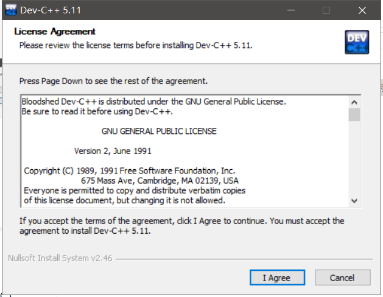  
同意协议 next 

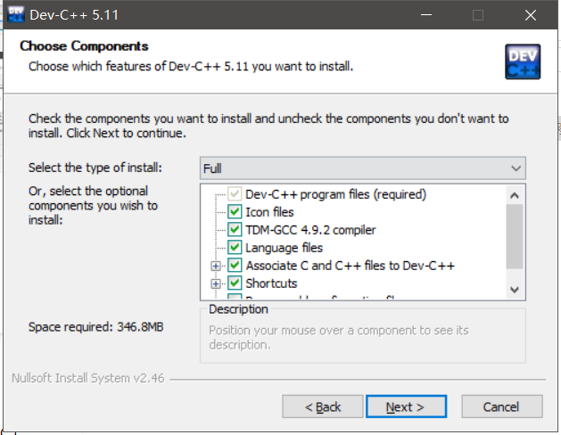  
如果我们没有安装过 C/C++ 的环境，选择默认。如果有那也不是小萌新了，选着自己要的功能，然后 next。

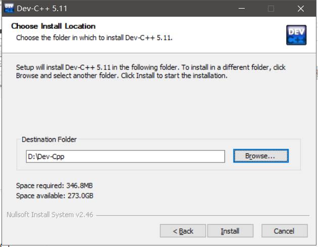  
选择安装路径，切记不要选着带有中文的路径，然后点击Install。

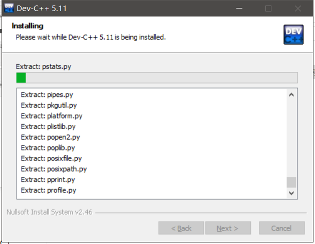  
等待安装完成。

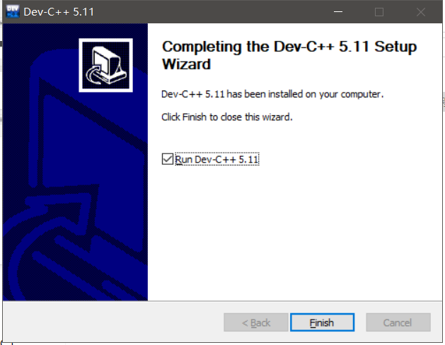  
现在我们 Dev C++ 安装完成啦~

## 设置 Dev C++
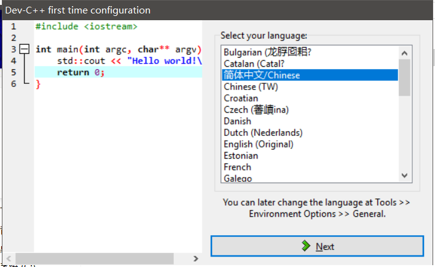  
首次打开 Dev C++ 的时候会要求选择语言，这这时候为了方便，并认识一些编程相关的中文名词，我们选择使用```简体中文```，然后 next。

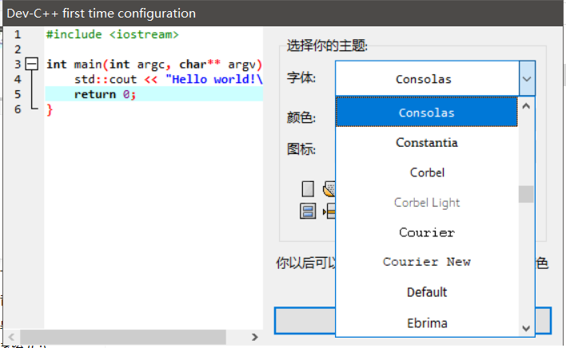  
这里我们可以选择字体，切记不要为了好看而选择一些诸如```微软雅黑```的字体。有些字体非等宽字体，在以后我们阅读代码的时候会造成不变。  
这里举个等宽字体和非等宽字体的例子。  

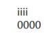这是非等宽字体，我们可以看到都是上下两排均是4个字符，但他的所占宽度不相等，这会非常影响我们后面学习编程时候的代码阅读。  

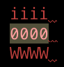这是等宽字体，我们可以看到，无论是 ```i``` 还是```0```或者```W```，他们每一个字符所在的宽度是一样的，这就很好的规范了我们以后编写代码的时候，有个较为严格的格式和美观度。  

现在回到我们的设置  
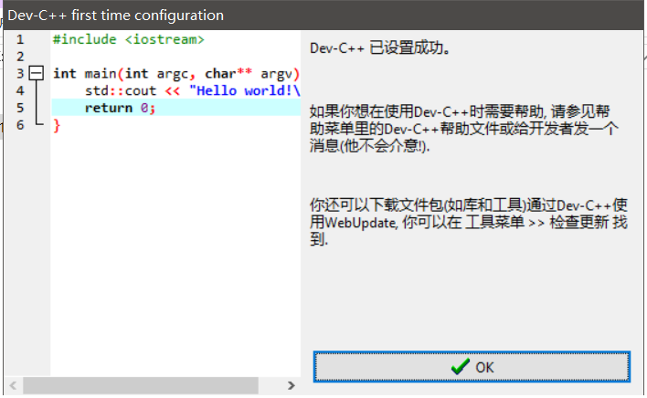  
刚刚我们选择了默认字体和默认图标显示，现在点击OK完成设置  

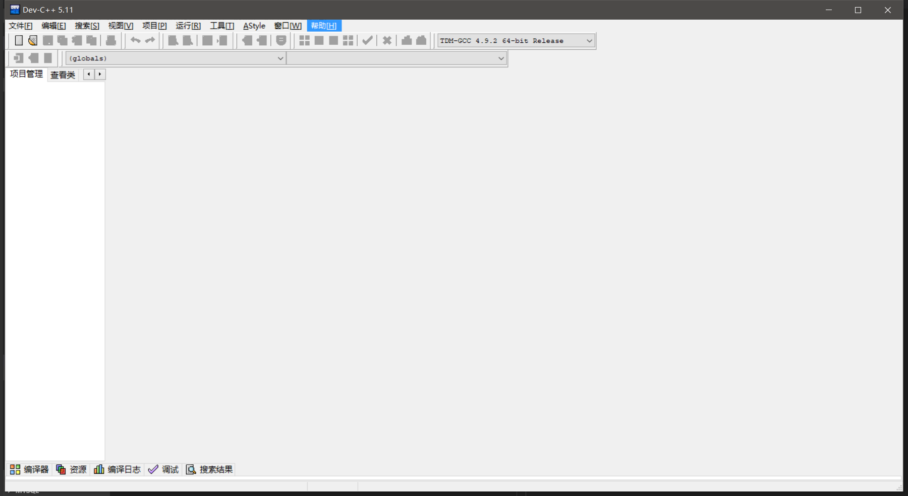  
现在我们就进入到了 Dev C++ 的主界面啦~，现在离成为百万程序员又近了一步  

## Hello World 程序员的浪漫  
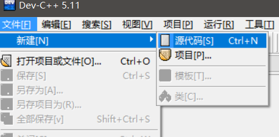  
点击 文件-> 新建-> 源代码就创建了一个完全的空白界面  

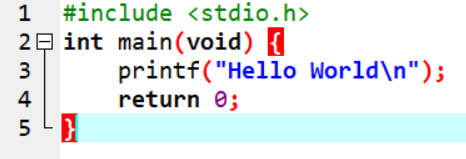  
在空白界面下，写下我们的第一个程序 Hello World 。
```c
#include <stdio.h>
int main(void) {
    printf("Hello World\n");
    return 0;
}
```
让我平复下此刻激动的心情，我也是能敲代码的人啦，这是我独享的moment~  

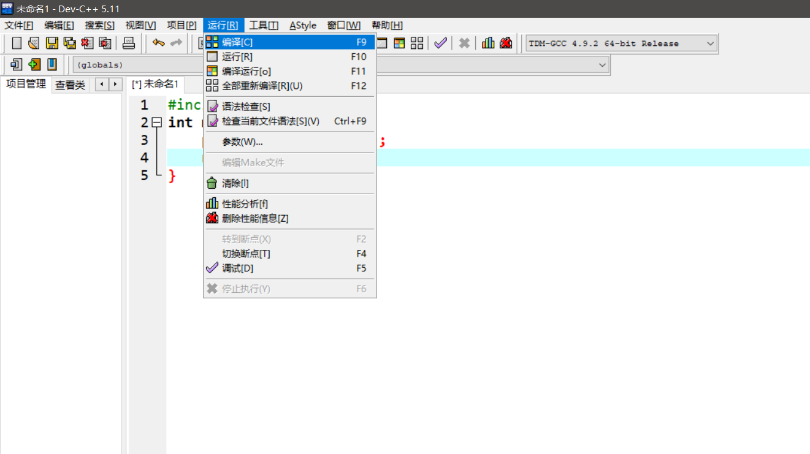  
点击 运行->编译  

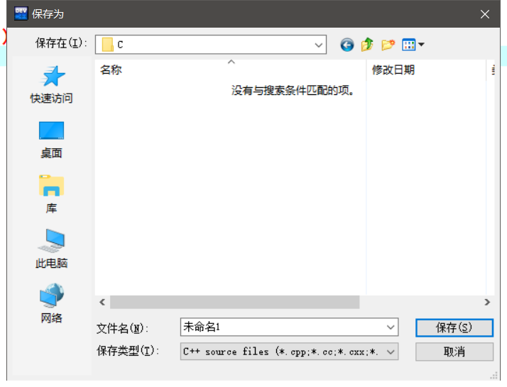  
在编译之前，我们需要保存一下这个 c 文件，为了方便以后整理和看代码，我们创建一个以后专门用来存放学习 C 语言时保存 c 文件的文件夹，切记路径不要带中文，为了养成一个良好的习惯，我们以后所以与编程相关的文件/文件夹，都不要带有中文，和存在带有中文的路径之下，因为有可能出现出乎意料的错误。

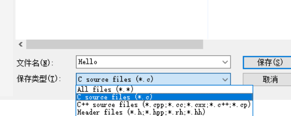  
选择好文件夹后，选入我们的文件名 ```Hello``` 选择保存类型 ```C source files (*.c)``` ，然后选择保存。

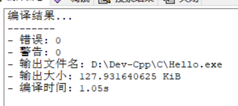  
保存完后，回到我们的主页面可以看到，编译结果，```0 warning(s) 0 error(s) ```，~~记住这个梗~~。

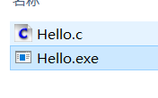  
编译完成后我们可以在刚刚保存 C 文件的文件夹中看到生成了一个 ```Hello.exe``` 文件。

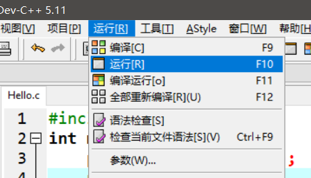  
回到我们的 Dev C++，点击 运行->运行  

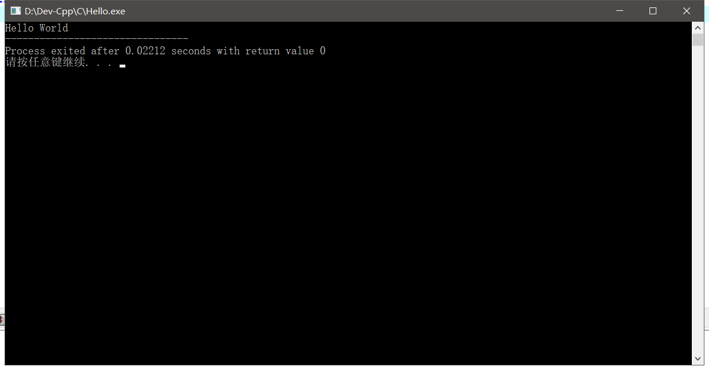  
然后我们就可以看到一个漂亮的``` Hello World ```
```
Hello World

--------------------------------
Process exited after 0.03668 seconds with return value 0
请按任意键继续. . .
```

现在恭喜我们，成功的完成了 C/C++ 的环境搭建。并写下了自己的第一个程序，今天离 996~~ICU~~ 又近了了一步