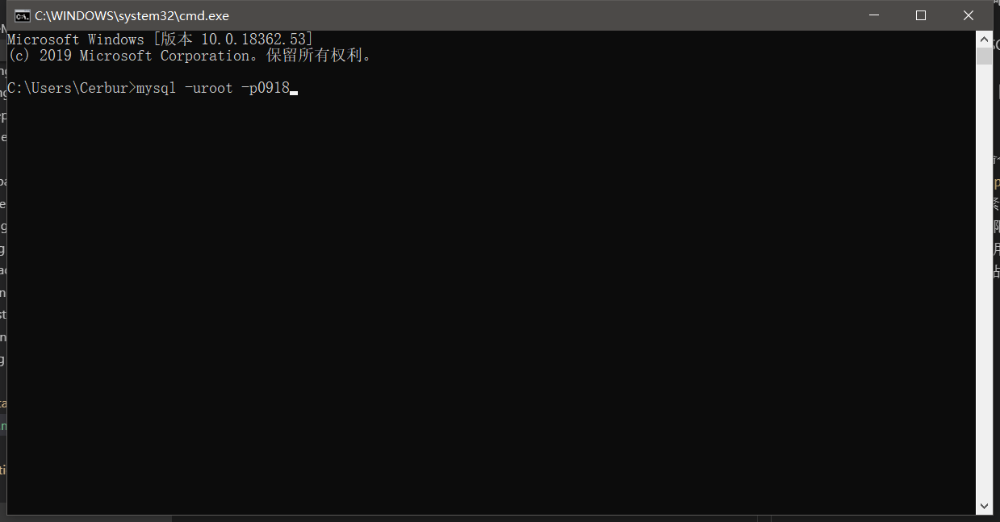
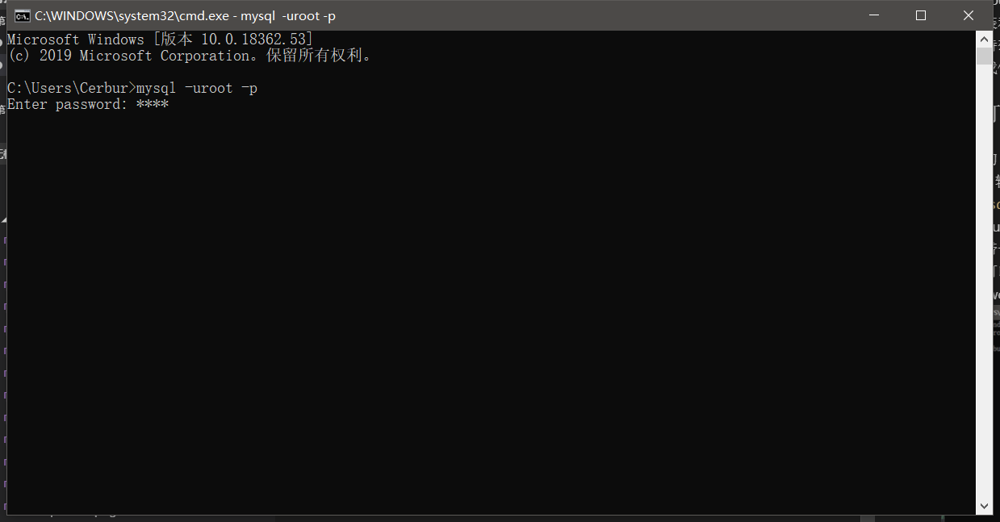
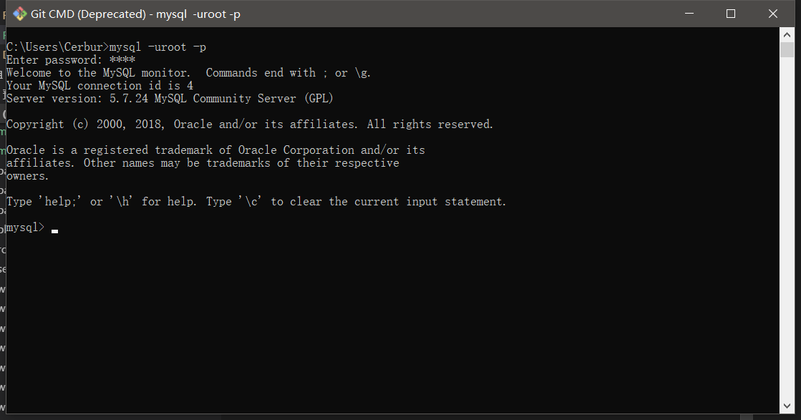
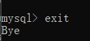

# 啊~是第一次/MySQL的登录与退出
- 作者Cerbur
- 终于安装和搭建完环境了吧
- 迫不及待想做点什么了吧
- 来，让我们第一次和 MySQL ~~交合~~连接  
## 在 CMD 打开 MySQL 的终端

0. Win + R 输入 cmd 打开命令提示符，输入 ```mysqld``` 然后你的 cmd 可能会卡死，所以卡了直接关了然后重开 cmd 继续下一步。  

1. 输入 ``` mysql -uroot -p[password]``` 然后enter，这里 ```-u```  user 的缩写后面紧贴你的用户名，开始自带一个有着所有权限的用户 root ，以后你可以自己创建新的用户。```-p``` password 的缩写后紧贴刚刚你输的密码。  

       

    ```警告：这样子登录会明文暴露密码，不推荐使用，所以另一种登录方式是 mysql -uroot -p ，enter 后再输入非明文密码这样更安全。```  

        

1. 输入完密码 enter 后就进入了 MySQL 的欢迎界面  

        

1. 输入 ```exit``` 即可退出 MySQL    

        

    **这里讲一下上面 mysqld 是啥**   
    mysqld 是 MySQL 的服务端程序，如果这个没打开就相当于服务没有打开。这时候 MySQL 是用不了的哦，服务开启后的 ```myslq -u[user] -p[password]``` 是登录到 MySQL 客户端的哦。虽然他只是命令行  
    但前期学习就靠他，很可爱。  

- 好哒现在已经完成了 MySQL 的登录与退出了  
- 熟悉一哈这些步骤  
- 接下来我们就开始要和数据库打交道啦  
