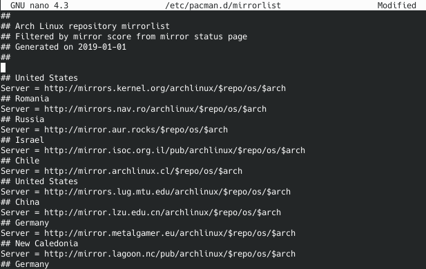
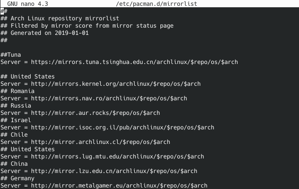

# ArchLinux 的安装教程

你去看 [**ArchWiki**](https://wiki.archlinux.org/index.php/Installation_guide_(%E7%AE%80%E4%BD%93%E4%B8%AD%E6%96%87)) 啊！

## 额外步骤
其实ArchWiki有一些东西没有强调出来，为了防止在安装之后翻车，所以有一些额外的步骤最好还是跟你们说一下比较好。

### 在 pacstrap 之前，先更换为中国境内的的源，来加速安装时下载软件的过程。

软件源的配置通过修改 **/etc/pacman.d/mirrorlist** 文件即可。

``` bash
nano /etc/pacman.d/mirrolist
```



在光标所在处添加
>清华Tuna源
```
Server = https://mirrors.tuna.tsinghua.edu.cn/archlinux/$repo/os/$arch
```

>中科大源
```
Server = https://http://mirrors.ustc.edu.cn/archlinux/$repo/os/$arch
```

>[还有其他的源](https://wiki.archlinux.org/index.php/Mirrors_(%E7%AE%80%E4%BD%93%E4%B8%AD%E6%96%87)#%E4%B8%AD%E5%9B%BD)

<br>
如图所示


这样我们就添加好了一个清华Tuna源

按 **Ctrl+O** 写入， **Crtl+M** 保存为 UTF-8， **Ctrl+X** 退出编辑

接下来使用 pacstrap 安装 Arch

### 安装好 pacstrap 并且配置了时区和语言之后
我们需要安装 **grub** 作为启动器来启动我们的 Archlinux，否则是不能启动的。

首先让我们安装：

``` bash
pacman -S efibootmgr grub
```

然后直接就可以按照[**这个步骤**](https://wiki.archlinux.org/index.php/GRUB_(%E7%AE%80%E4%BD%93%E4%B8%AD%E6%96%87)#%E5%AE%89%E8%A3%85)来安装grub